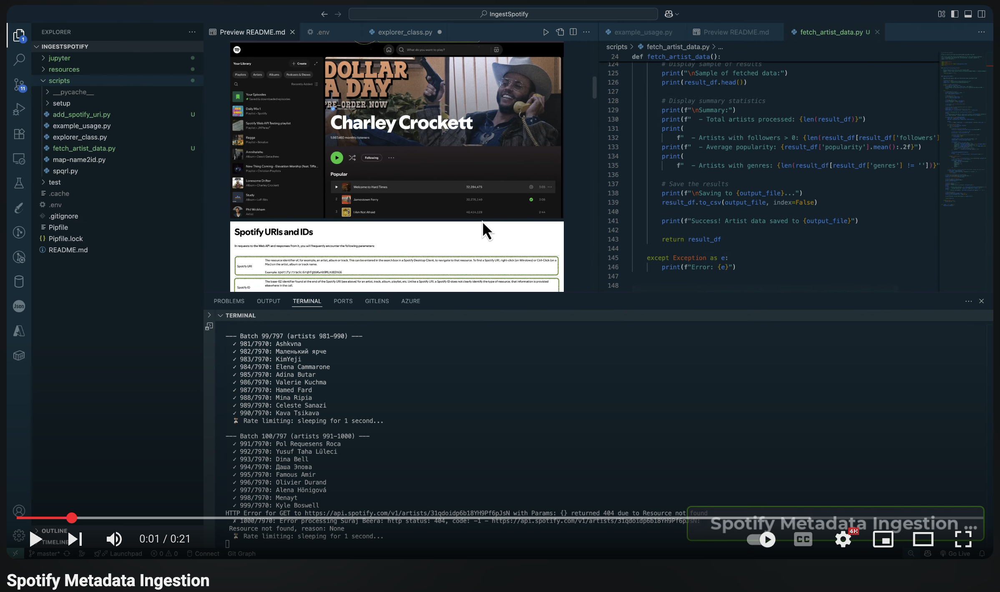
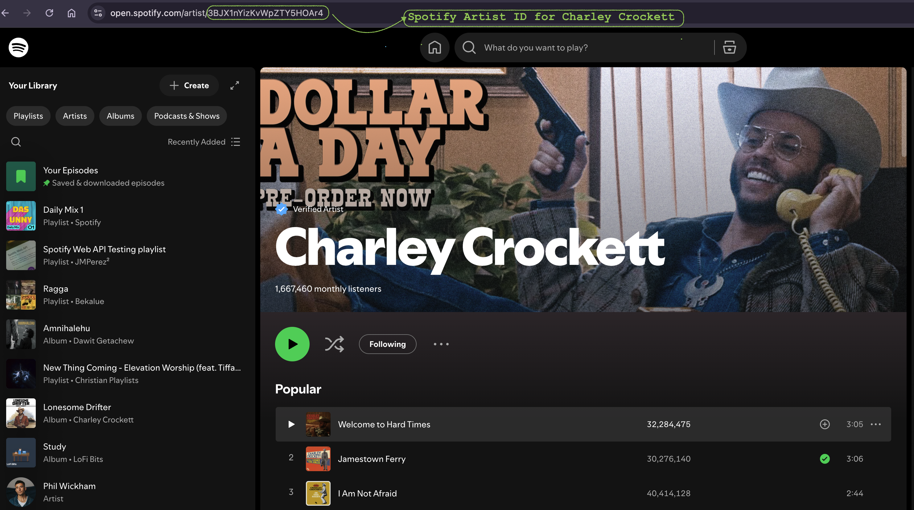
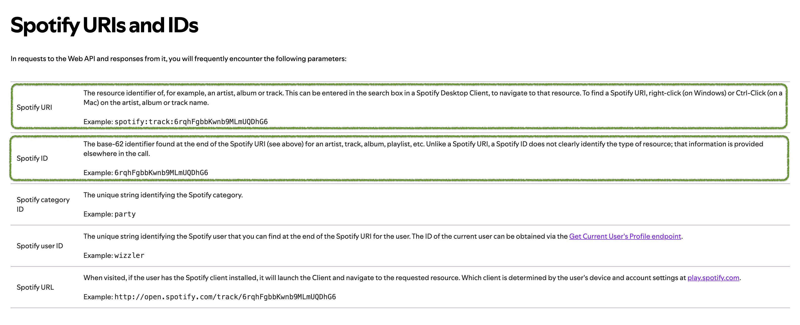
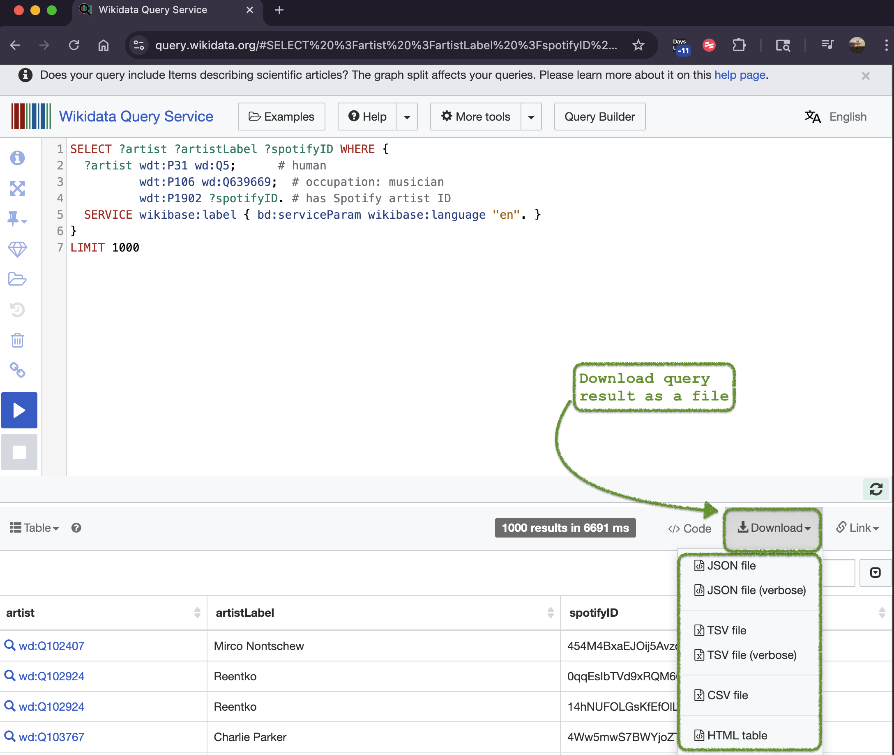

# Spotify Artist Metadata Pipeline

Python pipeline that collects Spotify artist IDs from Wikidata, writes them to CSV, and enriches rows with Spotify Web API metadata.

[](https://youtu.be/BMG9xX09JMg)

Spotify API calls need artist, album, or track IDs (embedded in URIs):




## Data Flow

```
Wikidata SPARQL  ->  artist ID CSV  ->  Spotify URL column  ->  Spotify Web API  ->  metadata CSV
```

1. **Source:** Wikidata musicians with a Spotify artist ID (`P1902`).
2. **Ingestion:** SPARQL query (scripted or Query Service CSV export).
3. **Transformation:** append `https://open.spotify.com/artist/{id}`.
4. **Enrichment:** Spotify `artist` endpoint fields (name, followers, popularity, genres, image URL, API href).
5. **Storage:** local CSV files under `data/`.

Included extract: `data/artists_spotify_ids.csv` (7,970 artists; columns `artist`, `artistLabel`, `spotifyID`). This file matches a Wikidata Query Service export, not the default output schema of `ingest_wikidata.py`.

## Tech Stack

- Python 3.11
- pandas
- requests (Wikidata SPARQL)
- spotipy (Spotify Web API, client-credentials auth)
- python-dotenv
- matplotlib (exploratory plots)

## Key Features

- Paginated SPARQL pulls with a 1-second delay between requests
- Spotify API calls in batches of 10 with a 1-second delay between batches
- Failed API rows written with empty/zero fields so the output stays aligned
- Lookup CSVs from search/top-track experiments (`data/spotify_*_lookup.csv`)
- Exploratory scripts for a single-artist profile, Global Top 50 playlist artists, and an estimated career timeline

Spotify does not expose official stream counts. Any listener/stream figures in exploratory scripts are heuristics from popularity and followers, not platform-reported totals.

## Structure

```
data/            ID extracts, URL-enriched IDs, lookup CSVs
scripts/         ingestion, transform, API fetch, client setup
exploratory/     ad-hoc analysis scripts and a Jupyter notebook
docs/            screenshots of Wikidata/Spotify ID usage
```

## Run

```bash
pipenv install
pipenv shell
```

Create `.env` in the project root:

```
SPOTIFY_CLIENT_ID=your_client_id
SPOTIFY_CLIENT_SECRET=your_client_secret
```

Credentials come from the [Spotify Developer Dashboard](https://developer.spotify.com/dashboard). Redirect URI used in app setup: `http://localhost:8888/callback`.

From `scripts/`:

```bash
python ingest_wikidata.py      # SPARQL extract (default cap: 1,000 rows)
python add_spotify_uri.py      # add SpotifyURI using data/artists_spotify_ids.csv
python fetch_artist_data.py    # write data/artists_metadata.csv
python example_usage.py        # inspect one sample artist payload
```

Exploratory:

```bash
python exploratory/artist_profile.py
python exploratory/spotify_analytics.py
python exploratory/justin_bieber_timeline.py
```

## SPARQL (artists)

```sparql
SELECT ?artist ?artistLabel ?spotifyID WHERE {
  ?artist wdt:P31 wd:Q5;
          wdt:P106 wd:Q639669;
          wdt:P1902 ?spotifyID.
  SERVICE wikibase:label { bd:serviceParam wikibase:language "en". }
}
LIMIT 1000
```

Results can also be downloaded as CSV from the [Wikidata Query Service](https://query.wikidata.org/):



[Spotify Web API](https://developer.spotify.com/documentation/web-api)
